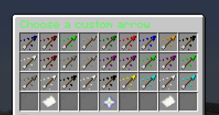
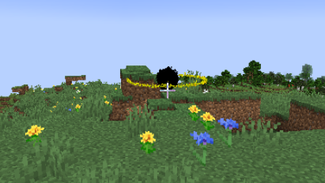

Hi! If you want to use the plugin, you have to drag and drop the downloaded JAR file into your server's plugin folder.
You can then just launch the server and use /customarrows to retrieve any arrow type you want. MC version: 1.20-1.21.1

The plugin adds 70+! more unique arrows to Minecraft without the need to use mods. Each of them is different and may serve a cool purpose.

Resource link: https://hangar.papermc.io/szym402pl/CustomArrows
preview:  ,  (black hole arrow)
